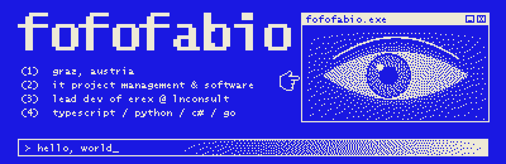
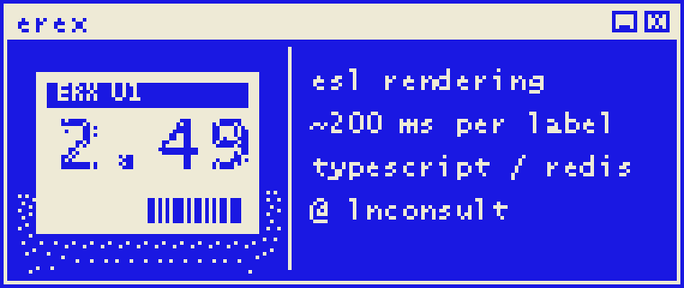
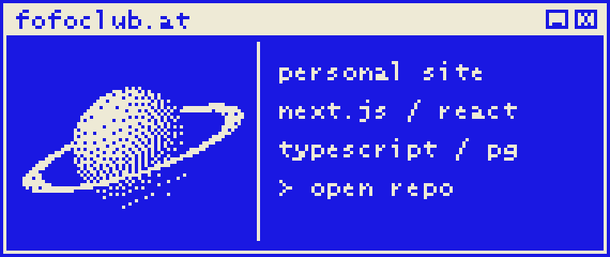
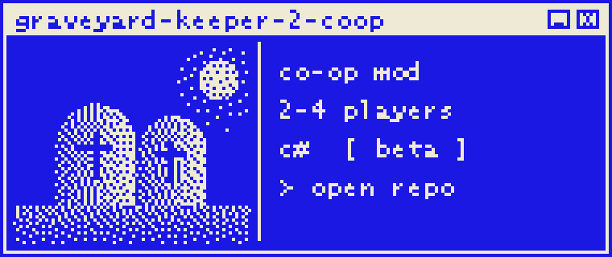
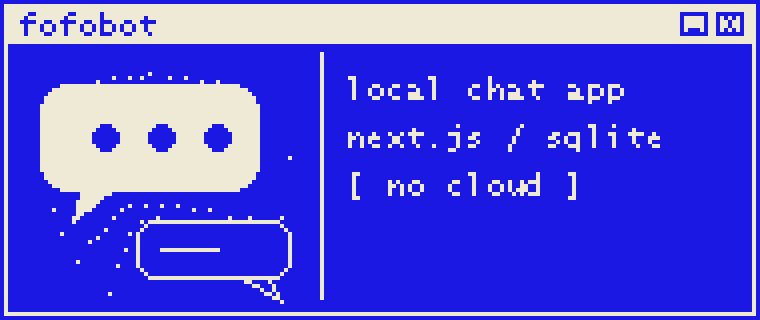

<p align="center">
  
</p>

```text
> whoami
  fabio unterholzer  //  graz, austria
  it project management & software

> cat now.txt
  junior it project manager @ lnconsult gmbh
  lead developer of erex, a distributed esl rendering engine

> ls ./projects
  erex    fofoclub.at    graveyard-keeper-2-coop    fofobot

> cat stack.txt
  typescript  python  c#  kotlin  go
  react  next.js  node  fastify  bullmq  redis  postgres  docker
```

<p align="center">
  <a href="https://www.fofoclub.at">fofoclub.at</a> &nbsp;·&nbsp;
  <a href="https://www.fofoclub.at/cv">cv</a> &nbsp;·&nbsp;
  <a href="https://www.linkedin.com/in/fabio-unterholzer">linkedin</a>
</p>

<p align="center">
  
  <a href="https://github.com/fofofabio/fofo-club"></a>
</p>
<p align="center">
  <a href="https://github.com/fofofabio/graveyard-keeper-2-coop"></a>
  
</p>

<p align="center">
   logout_" width="100%">
</p>
